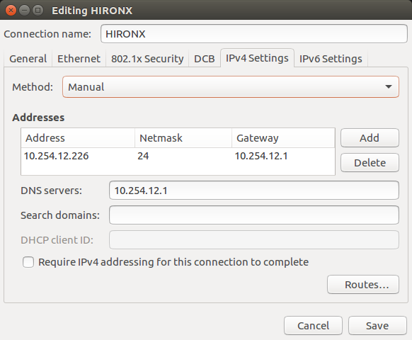

# hironx_stack

ROS Kinetic metapackage for the KAWADA HIRO-NX.

## Requirement (tested)

- Ubuntu 16.04
- ROS Kinetic
- Python 2.7

## Installation

1. Network configuration (only one time)  
  
  

2. Register hiro's IP address  
   \$ `sudo vim /etc/hosts`  
   Add below  
   `10.254.12.1 hiro012`

## Usage

1. Bring HIRO-NX up  
   - Push a green button of back of HIRO-NX.
   - If the 4-color blinking keeps after 5 to 10 minutes, restart with the green button.  
   - When it blinks green and white only, you are ready to use.
   - If the red light is on, the emergency stop button may have been pressed.

2. Calibration and initialization (choose from the following two options)  

(2-1) GUI activation (selective)  
   - \$ `rtmlaunch hironx_ros_bridge hironx_ros_bridge_real.launch nameserver:=hiro012`  
   - After opened GUI  
   - Push `joint calibration` button  
   - After moving robot  
   - Push `go initial pose` button  

(2-2) CUI activation   
   - \$ `` ipython -i `rospack find hironx_ros_bridge`/scripts/hironx.py -- --host hiro012 ``  
   - After opened ipython  
   - `robot.checkEncoders()`  
   - After completing movement  
   - `robot.goInitial()`

3. Open rviz and moveit    
   - \$ `roslaunch hironx_moveit_config moveit_planning_execution.launch`  
   - When the rviz screen comes up, completed preparation

4. Execute python script
   - \$ `rosrun hironx_stack head_banging.py`
   - \$ `rosrun hironx_stack turn_waist.py`
   - \$ `rosrun hironx_stack move_arms.py`

5. Shutdown the robot   

(5-1) GUI    
   - Push `go power-off pose` button   

(5-2) CUI
   - `robot.goOffPose()`  

## References

[RTMROS_NEXTAGE reference (Japanese)](https://rtmros-nextage.readthedocs.io/en/latest/index.html)  
[MoveIt! Commander reference](http://docs.ros.org/kinetic/api/moveit_commander/html/index.html)  

## Authors / Contributors

[Takuya Kiyokawa](https://takuya-ki.github.io/)  

